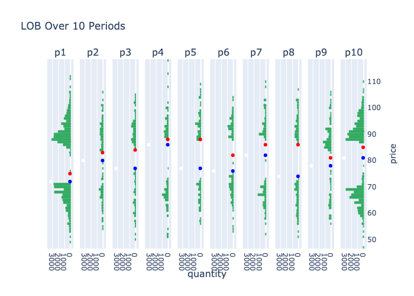

# lob-simulation


## Description
This project simulates a Limit Order Book (LOB) allowing participants 4 basic types of orders: bid order, ask order, market buy order, market sell order. 


## Simulation

Figure 1 below shows the evolving state of the LOB modeled with the best bid (blue) and best ask (red) for each simulated period.

<br><br>


## Install Instructions
##### Run on your local machine in a virtual environment with Python3.
```sh
git clone https://github.com/Traynak/lob-simulation.git
virtualenv -p python3 3envname
source 3envname/bin/activate
cd lob-simulation
pip3 install -r requirements.txt
python LOB-simulation.py
```

##### Run on your local machine with Docker.
```sh
git clone https://github.com/Traynak/lob-simulation.git
cd lob-simulation
docker build -t lob-sim .
docker run --name lob-sim -p 5001:5001 lob-sim
```


## References
*  [DrAshBooth's PyLOB Implementation](https://github.com/DrAshBooth/PyLOB/wiki/Implementation)

